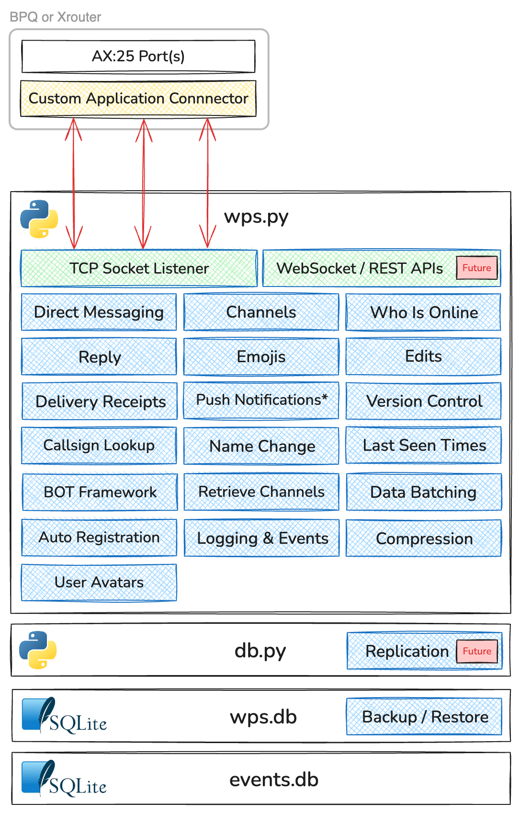

# WPS - A Messaging Service and Protocol for Packet Radio

WPS is a backend service and Layer 7 application protocol that provides messaging services over Packet Radio. Currently built to be published via a BPQ or Xrouter node, WPS is directly exposed to the AX.25 packet network and can be systematically accessed by end user applications. 

WPS was built specifically to enable the functionality in the WhatsPac front end, but could be used by any Packet Radio messaging application that implements its protocol.

WPS is capable of operating effectively without any internet dependency over link speeds of 1200 baud, albeit the latest 2400 and 3600 baud speeds offered by the NinoTNC are typically used and are the recommended minimum.

WPS runs entirely in Python, has minimal dependencies, minimal setup and runs with a single command. It can be run manually or as a service.

> [!IMPORTANT]
> WPS is in active development and is changing on a regular basis - please remember to watch the repo to be alerted when there are new versions

## Table of Contents
1. [WPS Schematic](#wps-schematic)
2. [Key functions](#key-functions)
3. [Server Capabilities](#server-capabilities)
4. [Future](#future)
5. [How WPS Works - An Overview](#how-wps-works---an-overview)
6. [Timestamps and Delivery Sequence](#timestamps-and-delivery-sequence)
7. [How WPS handles JSON](#how-wps-handles-json)
8. [Sending a JSON object to WPS (Javascript Example)](#sending-a-json-object-to-wps---a-javascript-example)
9. [Bots](#bots)
10. [Warm Reloading Code](#warm-reloading-code)


### WPS Installation and Protocol Documentation

Links to documentation in the `/docs` directory

1. [Installation](docs/installation/INSTALLATION.md)
2. [Protocol - General](docs/protocol/GENERAL.md)
3. [Protocol - Channels](docs/protocol/CHANNELS.md)
4. [Protocol - Messages](docs/protocol/MESSAGES.md)


## WPS Schematic


## Key Functions
- **Direct Messaging:** Message send and receive (similar to SMS, WhatsApp, Signal or iMessage)
- **Channels:** Post to themed channels (similar to a Rocket Chat, Slack or Discord)
- **Who is Online:** WPS updates clients when a user connects or disconnects
- **Reply:** Users can send new messages and posts, or reply to existing
- **Emojis:** Include and react to messages and posts with Emojis
- **Edits:** Edit messages and posts after sending
- **Auto Registration:** New users are automatically registered upon connecting
- **Push Notifications:** Send push notfications when there is new activity (requires integration with a Push notification service)
- **Callsign Lookup:** Enquire if a callsign is registered
- **Name Change:** WPS distrbutes display name updates, if changed
- **Last Seen Times:** See when users you have messaged were last connected
- **Events:** Capture events in a separate database for monitoring and analytics - e.g. user connected, user disconnected, bytes sent
- **Delivery Receipts:** WPS responds to new and edited messages and posts with a delivery receipt, guaranteeing server delivery
- **Version Control:** Advise the client a new software version is available, configurable within WPS in real-time
- **User Avatars:** Attach custom avatars / images
- **BOT Framework:** Build custom BOTs that integrate with channels

## Server Capabilities
- **Compression:** WPS compresses every packet before sending, then sends whichever of the compressed or uncompressed version is shorter
- **Data Batching:** WPS batches bulk post and message downloads, optimising compression and delivery
- **Logging:** WPS includes error logging by default, with extensive info logging configurable if required
- **Run as Service:** WPS runs as a standard linux service (and assume could on Windows too)
- **Warm Reload:** Deploy new message-processing and bot code to a running WPS instance without dropping any connected user - see [Warm Reloading Code](#warm-reloading-code)

## Future
- **Replication:** Supporting the ability to replicate to other WPS instances hosted on the Packet Network
- **Websocket / REST APIs:** For connecting directly over TCP/IP, it's the intent that WPS will offer Websocket and REST APIs for access. Possible use cases are via Hamnet or local sysop access

## How WPS Works - An Overview

WPS is designed for system access only - it does not provide a human interface for direct user access. To connect to WPS:

1. An application opens an AX.25 connection to the node hosting WPS
2. The application sends `WPS` (or whichever name configured) and the node opens the TCP connection to WPS. WPS expects the first string to be the connecting user's callsign 
3. The application then sends JSON compatible with the WPS Protocol and returns the corresponding JSON in response

> [!TIP]
> BPQ and Xrouter support publicising an application directly onto the AX.25 network with a callsign and alias. If configured, steps 1 and 2 can be merged. A connecting application can invoke WPS directly upon connecting

WPS is a reactive service - activity is only triggered upon receipt of an instruction from a connected user. It is also connection aware - if it recieves a message from T3EST addressed to M8ABC and M8ABC is connected, WPS will send the message to M8ABC in real-time

As an example, the sequence for a new message is:
1. WPS receives a type `m` JSON object from a connected application, meaning a new message
2. WPS writes the message to the database
3. WPS returns a delivery receipt to the connected application. 
4. WPS then decides:
   - if the recipient is connected, send in real-time
   - if the recipient is not connected, check whether registered for push notifications, send one if yes (NB: requires additional integrations)
   - if the recipient is not registered, end processing
5. If not sent in real-time, when the recipient connects and sends a type `c` JSON object, WPS will then return the new message(s)

## Timestamps and Delivery Sequence

Timestamps are used extensively in the design of WPS:
- Due to the potential variability within the RF packet network - where delivery times to the server can very depending on the number of hops, traffic and/or network drop outs - the timestamp assigned to a message or post by a connected application is used on both the server and all recipients. This ensures the sequencing of posts and messages remains as intended by the sender
- For Posts, the timestamp is also used to:
  - tell the sender how long a message took to reach the WPS by returning the server delivery timestamp `dts` to the client
  - tell connected recipients of a post the end-to-end delivery time, calculated by comparing the `ts` of the post to the timestamp it was received
- When downloading new posts, either on connect, subscribe or in real time, WPS always sends Posts and Messages in timestamp ASCENDING order - i.e. oldest first. This ensures if a user gets disconnected, the client can resume from the last message.

> [!WARNING]
> WPS works on the assumption that modern OSs have time synchronisation and therefore accurate clocks. Beware if offline or time synchronisation is not setup that sending posts and messages with an incorrect system clock could cause issues with certain functions

## How WPS handles JSON

WPS receives everything from the packet network and node as a string, with discrete packets delimited by `\r\n` (13 decimal & 10 decimal), Additional delimiters are used for compressed packets. 

WPS preprocesses received strings by:
- adding the string to an RX buffer
- splits the buffer on `\r\n` into an array
- for each string in the array:
   - if enclosed in compression delimiters, attempt decompression
   - if enclosed in `{}`, attempt conversion to a JSON object
   - if last in the array and is neither, it's imcomplete and is returned to the RX buffer, awaiting the next packet

If either of the decompression and/or JSON conversion fails, this is considered a FATAL error and WPS disconnects the user and log an `ERROR` in `wps.log`

The only exceptions to the above are the first and second strings received:
- The first string recieved is always the callsign - e.g. `T3EST\r\n`. This is sent by the node and happens before any subsequent processing
- If the second string fails conversion, this is likely a manual connect by a human. WPS returns a friendly message (configurable in `wps.py`) and then disconnects

> [!IMPORTANT]
> WPS strips the SSID, if one is received from the node. The WPS user is always the callsign minus any SSID.

> [!NOTE]
> The use of JSON offered many advantages when developing WPS:
> <br> 1. Conversion to JSON offers a very simple way of assuring data integrity across a number of fragmented packets, a feature of the varying PACLENs used across the network
> <br> 2. JSON is simple to use by both WPS and connected applications
> <br> 3. JSON offers complete flexibility to add / amend data when required
> <br> 4. JSON compresses well due to its repetitive use of certain characters. Overall compression typically achieves up to a 40% reduction in packet length
> <br><br>WPS could easily add support for a different payload construct without material effort. It already recognises and supports two payload types - compressed and native JSON

## Sending a JSON object to WPS - A Javascript Example

With an open channel to WPS, connected applications should:
1. Convert the JSON object to a string via `JSON.stringify` (Javascript), `json.dumps` (Python) or equivalent
2. Add a `chr(13)` and `chr(10)` or `\r\n` or equivalent, then send.

Javascript Example:

```javascript
const samplePost = {
   "t": "cp",
   "cid": 1,
   "fc": "T3EST",
   "ts": 1771755000289,
   "p": "1"
}
send(`${JSON.stringify(samplePost)}\r\n`)
```

## Bots

WPS includes a lightweight bot framework that allows channel bots to be added without modifying the core WPS code. Each bot is a self-contained Python module placed in the `bots/` directory.

Bots are only loaded if `botsEnabled` is set to `true` in `env.json` - when `false` (the default), `bots/bots.json` is not read and no bots are started.

`bots/bots.json` is the master record of which bots are active. For every key in `bots/bots.json`, WPS expects:
- A matching `bots/<name>.py` module
- A channel in `channels.json` with the configured `cid`, flagged `"b": true`

If either is missing, WPS logs an error at startup and skips loading that bot.

> [!TIP]
> A bot's code can be updated in place on a running server without disconnecting users or restarting WPS - see [Warm Reloading Code](#warm-reloading-code)

### Built-in Bot: Pacagotchi

Pacagotchi is a Tamagotchi-style pet that lives in a WPS channel and is cared for collectively by everyone on the network.

**Setup:** `botsEnabled` must be `true` in `env.json`, its channel in `channels.json` must be flagged `"b": true`, and it must be registered in `bots/bots.json`, keyed by bot name (the module under `bots/` to import). The `bots/bots.json` value is an object holding at least the channel id (`cid`) it should respond on - the bot also reads its parameters from here:

```json
{
    "pacagotchi": {
        "cid": 14,
        "tick_interval": 300,
        "age_juvenile": 3600,
        "age_adult": 172800,
        "hunger_drop_per_tick": 2,
        "happiness_drop_bored": 2,
        "health_drop_starving": 4,
        "health_drop_dirty": 2,
        "health_drop_ill_late": 8,
        "sleep_tick_multiplier": 0.25,
        "auto_sleep_after": 10800,
        "sleep_min_hours": 6,
        "sleep_max_hours": 10,
        "poop_rise_every_n_ticks": 7,
        "junk_illness_threshold": 3,
        "ill_death_timeout": 10800
    }
}
```

**Commands** (posted to the channel):

| Command | Description |
| - | :- |
| `/spawn` | Create a new pet (only when none exists or the previous one died) |
| `/feed [food]` | Feed the pet. Junk food keywords (`burger`, `pizza`, `chips`, `sweets`, `cake`, `donut`, `crisps`, `biscuit`) make it happier but risk illness after 3 in a row |
| `/play` | Play with the pet — raises happiness but costs hunger |
| `/clean` | Clean up poop — neglected poop causes illness |
| `/medicate` | Cure illness (requires health > 20%) |
| `/sleep` | Rest the pet — raises health, lowers happiness |
| `/pet` | Show the pet's current status and ASCII art |
| `/stats` | Full stats including top caretakers leaderboard |
| `/help` | Command reference |

The pet ticks every 5 minutes: hunger drops, poop accumulates, and health is affected by neglect. If health reaches zero the pet dies — use `/spawn` to start fresh.

### Adding a New Bot

1. Create a Python file in `bots/`, e.g. `bots/mybot.py`, exposing these three functions:

```python
def init(db_connection):
    """Called once at startup. Create any required DB tables here."""
    pass

def start_tick_thread(db_connection, broadcast_fn, channel_id):
    """
    Start a background thread for time-driven behaviour (optional).
    broadcast_fn(cursor, cid, text, from_callsign) posts a message to the channel.
    """
    pass

def handle_command(cursor, post_text, from_callsign):
    """
    Called when a slash command is posted to the bot's channel.
    Return {"text": str, "fc": str} to reply, or None to stay silent.
    """
    if not post_text.startswith("/"):
        return None
    return {"text": "Hello from mybot!", "fc": "MYBOT"}
```

2. Flag its channel `"b": true` in `channels.json`:

```json
{
    "cgid": 3,
    "cid": 12,
    "cn": "mybot",
    "cd": "My Bot",
    "b": true
}
```

3. Register it in `bots/bots.json`, keyed by bot name, with an object holding at least the channel id (`cid`) it should respond on. Add any other bot-specific config keys your module wants to read from that same object:

```json
{
    "mybot": {
        "cid": 12
    }
}
```

4. Ensure `botsEnabled` is `true` in `env.json`, then restart WPS — the bot is loaded automatically with no other changes required.

## Warm Reloading Code

WPS separates the TCP layer from the message-processing/business logic specifically so the latter can be updated on a running server without dropping a single connected user - important for a service reached over AX.25, where reconnecting isn't instant and mid-transfer state would otherwise be lost.

**How it works:** `wps.py` owns the listening socket, the accept loop, and every open connection's raw receive/buffer/framing loop - it never contains processing or database logic itself. All message handling (connect, messages, posts, channels, avatars, stats, dispatch/routing, bot broadcast, etc.) lives in `handlers.py`, and every database interaction lives in `db.py`. `wps.py` and `handlers.py` only ever call these via `handlers.<function>(...)` / `db.<function>(...)`. Every open connection's read loop looks the function up on the module fresh for each incoming packet, so swapping `handlers.py`'s or `db.py`'s code in place (`importlib.reload`) is picked up by every connection's *next* message - no restart, no dropped socket. `get_db_connection()` opens a fresh SQLite connection per call rather than caching one at module level, so there's no stale connection to worry about across a `db.py` reload. Loaded bot modules in `bots/` work the same way and are reloaded alongside `handlers.py` and `db.py`. State that must survive a reload (open connections, loaded bots, the channel cache) lives in `state.py`, which is never itself reloaded.

**To trigger it:** with WPS running attached to an interactive terminal (`python3 wps.py`), press `r` in that terminal - no Enter needed. This warm-reloads `db.py`, `handlers.py`, and every currently loaded bot module in one go (in that order) and prints a confirmation for each.

> [!WARNING]
> The `r` key listener only starts when WPS's stdin is an interactive TTY. **It is not available when WPS is run as a service** (e.g. via systemd with no attached terminal) or with stdin redirected/piped - in those setups, deploying a `db.py`, `handlers.py` or bot change requires a normal restart.

### What is included (reloadable via `r`, no restart, no disconnect)
- Everything in `handlers.py` - all message type handlers, the `t`-keyed dispatch logic, push notification logic, compression helpers, and channel cache sync logic
- Everything in `db.py` - every database query and schema-touching function (`dbUserSearch`, `dbInsertPost`, `dbInit`, etc.)
- Every bot module already loaded at startup (e.g. `bots/pacagotchi.py`) - both its tick/background behaviour and its slash-command handling. Bot state lives in the database, not the module, so nothing is lost on reload

### What is excluded (requires stopping and restarting `python3 wps.py`)
- **`wps.py` itself** - the TCP socket, accept loop, per-connection receive/buffer/framing loop and connection lifecycle. This is the part that must keep running uninterrupted, so it's deliberately never reloaded
- **`state.py`, `logger.py`, `env.py`** - none of these are reloaded; changes to shared state shape, logging setup, or environment loading need a restart
- **`env.json` changes that affect startup only** - e.g. `socketTcpPort` (the socket is already bound), `dbFilename`, `botsEnabled`, or logging levels set up once at startup
- **A brand new bot** added to `bots/bots.json` - bots are only imported and started once, during `startup_and_listen()` at process start. Reloading only re-executes bot modules already present in the running bot registry; a bot that wasn't loaded at startup needs a restart to be picked up (`channels.json` itself is still re-read on every client connect, independent of warm reload, so channel/group edits don't need either a reload or a restart)
- **A schema change that isn't purely additive** - e.g. reloading a `db.py` change that renames or drops a column read by code that hasn't been reloaded yet, or that requires a one-off migration `dbInit()` won't apply to an already-open database. Purely additive changes (a new function, a new `CREATE TABLE IF NOT EXISTS`) are safe; anything that changes what existing rows or connections look like is safest applied with a restart
- **Any syntax or import error in `db.py` or `handlers.py`** at reload time - the reload is caught and logged as an `ERROR` without crashing the server, but leaves the previous, still-working code in place until a valid reload succeeds. Always check a change parses cleanly (e.g. `python3 -c "import handlers"`) before reloading a live node
