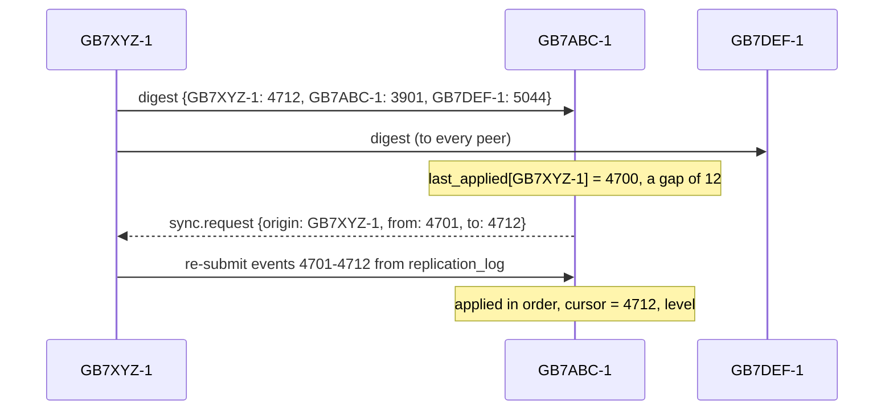
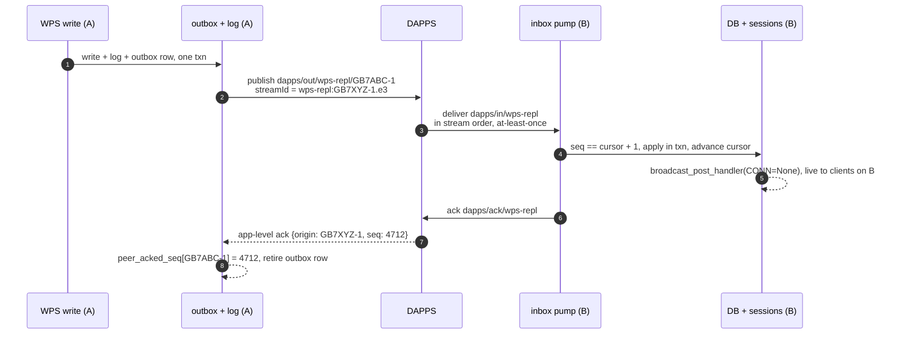

# Replication - Design Proposal

Replicating WPS between BPQ packet nodes over DAPPS

## Table of Contents

1. [Status](#status)
2. [Summary](#summary)
3. [The Replication Event](#the-replication-event)
4. [Pipeline](#pipeline)
    1. [Capture - transactional outbox](#01-capture---transactional-outbox)
    2. [Publish - the outbox pump](#02-publish---the-outbox-pump)
    3. [Transport - what DAPPS handles](#03-transport---what-dapps-handles)
    4. [Receive and apply - the inbox pump](#04-receive-and-apply---the-inbox-pump)
    5. [Validate - has everything landed?](#05-validate---has-everything-landed)
    6. [Reconcile - anti-entropy](#06-reconcile---anti-entropy)
5. [One Change, End to End](#one-change-end-to-end)
6. [Convergence](#convergence---making-instances-agree)
7. [What Replicates and What Stays Node-Local](#what-replicates-and-what-stays-node-local)
8. [Schema Additions](#schema-additions)
9. [Failure Modes to Test](#failure-modes-to-test)
10. [Decisions](#decisions)

[Return to README](/README.md)

> [!NOTE]
> This is the design proposal as agreed before implementation, kept for its reasoning. For how the feature actually behaves, how to set it up and how to operate it, see [Replication - How It Works](/docs/replication/REPLICATION.md). Where the implementation departed from this proposal, the [Status](#status) table says so, and the relevant sections carry an **As built** note.

Draft for review, 2026-09-06.

## Status

Version 1 implements the proposal's core: capture, publish, receive and apply, acknowledgement and reconciliation, for channel posts, direct messages and user names. Differences and deferrals:

| Topic | Proposed | As built in version 1 |
| - | - | - |
|Outbox pump|One scan of unsent outbox rows, tracking `dapps_ids` per row|A `submitted_seq` cursor **per peer** (new column on `replication_peer_ack`). A dead peer stalls only itself; per-peer order is guaranteed|
|Receiving from DAPPS|MQTT subscribe or REST poll|REST poll only|
|Digest|A version vector: highest `seq` seen per origin|Each instance reports **only its own** `latest_seq` to each peer. Sufficient for a full mesh; a version vector would be needed to relay through intermediate instances|
|Peer trust|Not covered|Inbound messages are accepted only from configured peers|
|Emoji reactions|Applied and fanned out live (`cpem`, `mem`)|Applied to the database only; no live push. The captured event has the merged reaction list, not the add/remove delta the live objects need|
|`user.update`|`name` and other portable fields|`name` and `name_last_updated`, guarded by `name_last_updated`. Unknown users are ignored|
|Avatars|`avatar.update` operation|Not implemented|
|Edit or reaction before its insert|Buffered until the insert arrives|Handled by `seq` ordering and gap buffering. An edit that still finds no post raises and is retried|
|Instance rebuild|"seq restored from the replicated DB"|Not automatic. Documented manual recovery; a digest lower than the applied cursor is logged as an error|
|`epoch`|Bumps when the seq store is reinitialised|Stamped on events and used in the stream id; bumped by hand, never automatically|
|Log retention|"Long retention window"|Never pruned|
|Configuration|`env.json` `replicationPeers`|`env.json` `replication` block (`enabled`, `originCallsign`, `peers`, ...)|
|Capture failure|Not specified|Errors are logged and swallowed so a replication fault can never fail a user's write|

## Summary

WPS already funnels every user-driven write through a handful of functions in `db.py`, and already builds a broadcast-ready object for connected sessions. Replication reuses both: capture a *semantic change event* in the same transaction as the write, ship it over DAPPS, and on the far side feed it straight back into the existing apply and broadcast path.

| | |
| - | - |
|**Transport**|DAPPS app slug `wps-repl`, at-least-once, one submission per peer callsign|
|**Unit**|A normalised mutation event - not raw client frames, and not row-level change capture|
|**Ordering**|A per-origin, gap-free `seq`, carried on a DAPPS `streamId` for in-order delivery|
|**Validation**|Per-peer acknowledgement cursors, plus a periodic digest for anti-entropy|

## The Replication Event

One envelope for every replicated change. `origin` and `seq` are the application-level identity: they survive independently of DAPPS and are never rewritten by a relaying hop. `data` carries exactly what the receiver needs to both persist the change and hand it to `broadcast_post_handler`.

```json
{
  "v": 1,
  "origin": "GB7XYZ-1",
  "seq": 4712,
  "epoch": 3,
  "ts": 1712345678901,
  "op": "post.edit",
  "key": { "cid": 4, "ts": 1712345671000 },
  "data": { "edts": 1712345678901, "p": "corrected text", "ed": 1 }
}
```

| Field | Meaning |
| - | - |
|`origin`|Instance identity. The SSID is significant|
|`seq`|Gap-free, monotonic per origin, assigned inside the write's transaction|
|`epoch`|Bumps if the instance's `seq` store is reinitialised|
|`ts`|The native precision of the entity - see [Convergence](#convergence---making-instances-agree)|

| `op` | Source handler | Key | Apply, then broadcast |
| - | - | - | - |
|`post.insert`|`post_handler`|`cid`, `ts`|`dbInsertPost`, then `broadcast_post_handler`|
|`post.edit`|`post_edit_handler`|`cid`, `ts`|`dbUpdatePost`, then `cped` fan-out|
|`post.emoji`|`post_emoji_handler`|`cid`, `ts`, `callsign`, emoji|`dbUpdatePost`, then `cpem` fan-out|
|`msg.insert`|message handler|`_id`|`dbInsertMessage`, then the recipient's session|
|`msg.edit`, `msg.emoji`|message edit and emoji|`_id`|`dbUpdateMessage`, then the session|
|`user.update`|connect (`c`), `u`|`callsign`|`dbUserUpdate`, then `u` fan-out|
|`avatar.update`|`a`, `ar`|`callsign`|avatar store, then `ae` responders|

Channel definitions come from `channels.json`. Treat that as configuration managed out of band, not as replicated data.

> [!NOTE]
> **As built:** reactions have no live fan-out, `user.update` has none either, and `avatar.update` is not implemented. See [Status](#status).

## Pipeline

The pipeline is a real sequence, so its stages are numbered.

### 01 Capture - transactional outbox

Add a thin seam inside the write functions in `db.py` (`dbInsertPost`, `dbUpdatePost`, `dbInsertMessage`, `dbUpdateMessage`, `dbUserUpdate`...). When a write succeeds and a thread-local `applying_remote` flag is *not* set, write two more rows **in the same SQLite transaction**:

- `replication_log` - append-only, the full envelope, kept for a long retention window. The source of truth for reconciliation and for bootstrapping a new instance.
- `replication_outbox` - the delivery worklist: a row per local `seq`, retired once every peer has acknowledged it.

Atomicity is the point. If the post commits, the intent to replicate commits with it; if the write rolls back, so does the intent. "Every user write is published" becomes true by construction, rather than by careful coding in every handler.

The `seq` is allocated here too, from the single-row `replication_self` counter, inside the transaction, so it is gap-free and matches `replication_log` exactly.

> [!IMPORTANT]
> Do **not** publish to DAPPS synchronously from the handler. A user's post must never fail because the local DAPPS daemon is down. The outbox decouples the write from the wire.

> [!NOTE]
> **As built:** capture errors are additionally swallowed and logged, so a bug in replication cannot fail the write it rides along with.

### 02 Publish - the outbox pump

A process-lifetime worker, started from `wps.py` rather than `handlers.py` (which warm-reloads), with its own database connection. It reads unsent `replication_outbox` rows in `seq` order and, for each, submits once per peer:

```
POST /AppApi/outbound
{
  "app": "wps-repl",
  "destCallsign": "GB7ABC-1",
  "payload": "<base64 envelope>",
  "streamId": "wps-repl:GB7XYZ-1.e3",
  "streamGapTimeoutSeconds": 0
}
```

DAPPS has no multicast, so fan-out is an explicit loop over the configured peers. For a mesh of a few nodes that is fine; revisit a hub or relay topology only past roughly five.

The `streamId` gives the receiving daemon in-order delivery for the common case. The `.e3` suffix is the `epoch`: if this instance is ever rebuilt and its counter resets, the epoch bumps and receivers do not silently drop the "stale" low sequence numbers. `streamGapTimeoutSeconds: 0` is strict - wait for the missing predecessor rather than skip it - which is the right default when guaranteed delivery is the goal, paired with the gap-age alert from [Validate](#05-validate---has-everything-landed).

Record the returned `dapps-id` per peer on the outbox row and mark it submitted. Keep the row until every peer has acknowledged at the application level.

> [!NOTE]
> **As built:** progress is tracked per peer with a `submitted_seq` cursor, and the pump stops for a peer at its first failure. The single scan proposed here let a dead peer's half-submitted rows crowd newer events out of the batch and stall healthy peers.

### 03 Transport - what DAPPS handles

Between nodes DAPPS runs its `DAPPSv1>` prompt and the `ihave` / `send` / `data` / `ack` exchange over whatever bearer is available (AGW today). It does routing, retry, per-hop TTL decrement, fragmentation and acking. WPS never sees any of it - only the local MQTT topics or `/AppApi` endpoints.

What this buys, and its edges:

- **At-least-once, content-addressed.** A redelivery arrives with the same `dapps-id`. The application must be idempotent regardless.
- **Ordering is opt-in** and enforced only at the receiving daemon; intermediate hops still reorder and retry freely. Our own `seq` is the backstop.
- **Payloads are small.** Posts and messages sit far below the 4 KB fragment threshold. Only avatars could fragment - transparent, but a reason to give `avatar.update` a longer TTL or its own slug.
- **The BPQ Telnet bridge rewrites LF to CR** on the apps-to-user path; DAPPS already tolerates this in its prompt scan, so nothing extra is needed here.

### 04 Receive and apply - the inbox pump

A second lifetime worker subscribes to `dapps/in/wps-repl` at QoS 1 (or polls `GET /AppApi/inbound/wps-repl`). Per message:

1. Parse the envelope. The idempotency key is `(origin, seq)` - *not* `dapps-id`. Read the per-origin cursor `last_applied_seq`.
2. `seq <= last_applied_seq`: already done. Ack DAPPS, return.
3. `seq == last_applied_seq + 1`: apply now, then drain any now-contiguous rows from `replication_pending`.
4. `seq > last_applied_seq + 1`: a gap. Persist to `replication_pending`, ack DAPPS (the transport was fine), fire a `sync.request` to the origin.

**Applying** is one SQLite transaction, with `applying_remote = True` so the capture seam stays silent:

- An idempotent, guarded database write (see [Convergence](#convergence---making-instances-agree) for the per-entity rule).
- Advance `last_applied_seq` for that origin. Commit.

**After commit**, run the existing fan-out - `broadcast_post_handler(...)`, the `cped` / `cpem` / `u` loops - passing `CONN=None` for the sender. That path already supports a null sender (it is how `bot_broadcast_to_channel` works), so a client currently connected to *this* node sees the replicated change live, exactly as it would a local one.

Then ack DAPPS on `dapps/ack/wps-repl`, and emit an application-level acknowledgement back to the origin: `{ "op": "ack", "origin": "GB7XYZ-1", "seq": 4712, "by": "GB7ABC-1" }`. That acknowledgement is what drives validation.

> [!NOTE]
> **As built:** REST polling is used, and inbound messages are checked against the configured peers before anything else. See [Status](#status).

### 05 Validate - has everything landed?

Three distinct questions, three mechanisms.

**1. Did every local write reach the outbox?** Guaranteed by the shared transaction. An optional cheap audit: periodically compare counts or checksums of rows changed since *T* against `replication_log` rows since *T*.

**2. Has every peer applied everything I originated?** Keep `peer_acked_seq` per peer, advanced by the application-level `ack` events. Outbox row `seq = N` is fully replicated once `min(peer_acked_seq) >= N`.

*Metric:* per peer, `my_latest_seq - peer_acked_seq` is the replication lag. Alert when the oldest un-acked outbox row is older than a threshold.

**3. Have I applied everything every peer originated?** Per origin, expose `last_applied_seq`, the pending-gap list from `replication_pending`, and the age of the oldest gap. A non-empty gap older than the threshold means alert, and `sync.request`.

DAPPS's own `/Streams` page (sender counters against receiver cursors, pending row counts) and its transmission audit log give a second, transport-level view for free.

> [!NOTE]
> **As built:** questions 2 and 3 are answered by SQL queries over `replication_peer_ack`, `replication_origin_cursor` and `replication_pending`, given in [Monitoring and Operations](/docs/replication/REPLICATION.md#monitoring-and-operations). There is no age-based alerting; backlog counts are logged each reconcile tick.

### 06 Reconcile - anti-entropy

The always-on cross-check. Each instance periodically broadcasts a small digest - the highest `seq` it has seen per origin. Any peer that is behind pulls the difference from the origin's `replication_log`. This heals anything ordering alone cannot: stream resets, TTL expiry, multi-week outages, bugs.



**Bootstrapping a new instance.** A fresh node is the same pull with `from_seq = 0` per origin - or, for a large history, ship a database snapshot out of band and start the tail from the snapshot's per-origin seq vector.

Keep `replication_log` (durable, full envelope, long retention) distinct from `replication_outbox` (transient worklist). The log is what every reconciliation and every bootstrap reads from.

> [!NOTE]
> **As built:** the digest is the sender's own `latest_seq` only, not a full vector, which is sufficient because every instance talks directly to every other.

## One Change, End to End

The happy path: a post edit on GB7XYZ-1 reaching a connected client on GB7ABC-1.



**Loop prevention.** Applying a remote event sets `applying_remote`, so the fan-out on B never re-enters the capture seam. In a relay topology, B forwards A's envelope verbatim - `origin` and `seq` stay A's - and the `(origin, seq)` dedupe stops any A to B to C to A circulation.

## Convergence - making instances agree

Packet radio is high-latency, so concurrent edits on two instances *will* happen. Each entity needs a deterministic rule so every instance lands in the same state regardless of arrival order.

> [!WARNING]
> Note the timestamp precision trap. WPS messages are keyed in **seconds** since epoch, posts in **milliseconds**. The event `ts` and `key` must carry each entity's native precision.

| Entity | Rule | Guard |
| - | - | - |
|Post or message insert|First-writer-wins; content is immutable|`INSERT ... ON CONFLICT DO NOTHING`. Add a unique index on `posts(cid, ts)` to match `idx_unique_message_id`|
|Post edit (`cped`), message edit|Last-writer-wins on the edit's own timestamp|`WHERE json_extract(post,'$.edts') < :edts` - never apply a stale edit|
|Emoji reaction|Converges as a set|Key each reaction on `(callsign, emoji)` with its own ts; add and remove commute|
|User record|Field-level last-writer-wins|A per-field or per-record `lhts` guard; node-local fields excluded entirely|
|Same key, divergent content|Conflict|Near-impossible given ms + author precision; if it occurs, tiebreak deterministically on `(ts, origin)`|

> [!NOTE]
> **As built:** inserts, edits and reactions follow these rules, with the guard applied in code before the write. Reactions are guarded on `ets` and replace the whole merged list rather than merging per `(callsign, emoji)`. User updates are guarded on `name_last_updated`, not `lhts`. A same-key conflict is not tie-broken; the first writer at each instance wins.

## What Replicates and What Stays Node-Local

**Replicated - shared truth**

- Messages: insert, edit, emoji
- Posts: insert, edit, emoji
- User `name` and other portable profile fields
- Avatars (consider a separate slug or longer TTL)
- Pairing state - only if pairing should follow a user between nodes

**Node-local - do not replicate**

- `is_online`, `last_connected`, `last_client_version`
- `channel_notifications_since_last_logout`
- Push-notification player IDs
- Per-user channel pause and subscription preferences
- Connection and thread state in `state.py`

Presence is per-node truth. If instances must show each other's online users, gossip it on a separate short-TTL channel marked non-authoritative - never through the ordered replication stream.

## Schema Additions

```sql
CREATE TABLE replication_self (          -- single row: identity + counter
  id INTEGER PRIMARY KEY CHECK (id = 1),
  origin_id TEXT NOT NULL,
  next_seq  INTEGER NOT NULL DEFAULT 1,
  epoch     INTEGER NOT NULL DEFAULT 1
);

CREATE TABLE replication_log (           -- append-only history, source of truth
  origin TEXT NOT NULL,
  seq    INTEGER NOT NULL,
  ts     INTEGER NOT NULL,
  op     TEXT NOT NULL,
  event  TEXT NOT NULL,                  -- full JSON envelope
  PRIMARY KEY (origin, seq)
);

CREATE TABLE replication_outbox (        -- local send worklist
  seq          INTEGER PRIMARY KEY,      -- == replication_log.seq WHERE origin = self
  dapps_ids    TEXT,                     -- json { peer: dapps-id }
  submitted_at INTEGER
);

CREATE TABLE replication_origin_cursor ( -- how far we've applied each origin
  origin           TEXT PRIMARY KEY,
  last_applied_seq INTEGER NOT NULL DEFAULT 0
);

CREATE TABLE replication_peer_ack (      -- how far each peer has applied our stream
  peer           TEXT PRIMARY KEY,
  peer_acked_seq INTEGER NOT NULL DEFAULT 0,
  last_digest_at INTEGER
);

CREATE TABLE replication_pending (       -- out-of-order arrivals awaiting predecessor
  origin TEXT NOT NULL,
  seq    INTEGER NOT NULL,
  event  TEXT NOT NULL,
  PRIMARY KEY (origin, seq)
);
```

> [!NOTE]
> **As built:** `replication_peer_ack` also has `submitted_seq INTEGER NOT NULL DEFAULT 0`, the per-peer publish cursor. `replication_self.origin_id` is nullable, and `last_digest_at` is unused. The current DDL is in `db.py`'s `dbInit`.

## Failure Modes to Test

- [ ] DAPPS daemon down for hours: the outbox grows, and drains in `seq` order on recovery.
- [ ] Peer down for days: the digest and `sync.request` bring it level; exercise the pull path directly.
- [ ] Duplicate delivery: the `(origin, seq) <= last_applied_seq` fast-path means no double apply and **no double broadcast**.
- [ ] Edit arrives before its insert: buffered in `replication_pending`, applied after the insert.
- [ ] Partitioned split-brain edits to the same post: deterministic last-writer-wins; assert both instances end byte-identical.
- [ ] Instance rebuilt, counter reset: the `epoch` suffix prevents stale-drop; `seq` restored from the replicated database.
- [ ] Relay circulation A to B to C to A: `(origin, seq)` dedupe halts it within one lap.
- [ ] Warm reload of `handlers.py` mid-replication: pumps in `wps.py` keep running; no lost or duplicated rows.

> [!NOTE]
> **As built:** the capture, apply, idempotent redelivery, gap buffering, per-peer outbox, acknowledgement retirement, peer allowlist and digest and resend paths were exercised in isolation against a copy of a real database with DAPPS mocked. None of this list has yet been run between real instances over real DAPPS, and the rebuild scenario has no automatic handling.

## Decisions

| Decision | Recommendation | Why |
| - | - | - |
|App slug|`wps-repl`|Descriptive; leaves `wps` free for any future user-facing app|
|Topology|Full mesh now|Trivial for a handful of nodes; revisit a hub past about five peers|
|TTL on the live stream|Long (for example 7 days)|Stops ancient replays; reconciliation is the backstop for anything older|
|Gap policy|`streamGapTimeoutSeconds: 0` (strict)|Guaranteed delivery is the goal; the gap-age alert surfaces a truly lost message|
|Avatar transport|Its own slug or a long TTL|The only payload that can cross the 4 KB fragment threshold|
