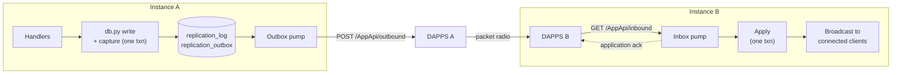
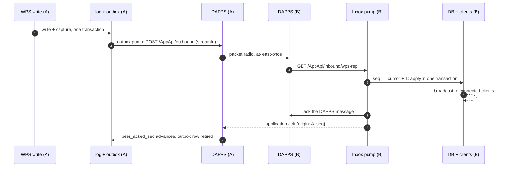
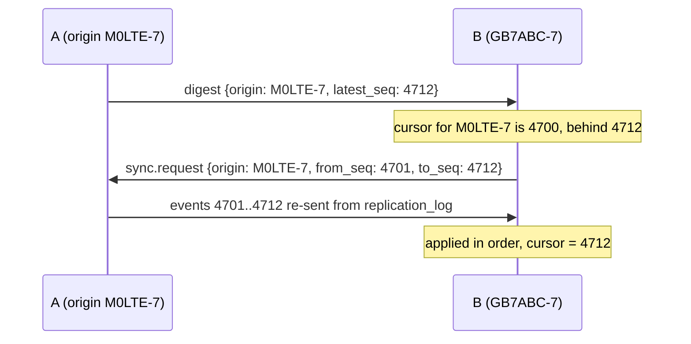

# Replication - How It Works

## Table of Contents

1. [Overview](#overview)
2. [Setup](#setup)
3. [What Is Replicated](#what-is-replicated)
4. [The Replication Event](#the-replication-event)
5. [Processing](#processing)
    1. [Capture](#1-capture)
    2. [Publish - the outbox pump](#2-publish---the-outbox-pump)
    3. [Transport - DAPPS](#3-transport---dapps)
    4. [Receive - the inbox pump](#4-receive---the-inbox-pump)
    5. [Apply](#5-apply)
    6. [Acknowledge](#6-acknowledge)
    7. [Reconcile](#7-reconcile)
6. [Data Model](#data-model)
7. [Guarantees and Failure Behaviour](#guarantees-and-failure-behaviour)
8. [Monitoring and Operations](#monitoring-and-operations)
9. [Rebuilding or Restoring an Instance](#rebuilding-or-restoring-an-instance)
10. [Known Limitations](#known-limitations)
11. [Code Map](#code-map)

[Return to README](/README.md)

> [!NOTE]
> This document describes what is implemented. For the reasoning behind the design, the alternatives considered and the parts deliberately left for later, see [Replication - Design Proposal](/docs/replication/DESIGN.md).

## Overview

Replication keeps two or more WPS instances - each on its own BPQ node - holding the same messages, channel posts and user names. It is built on [DAPPS](https://packet-net.github.io/dapps/) (Distributed Asynchronous Packet Pub-Sub), a store-and-forward messaging layer for packet radio that provides at-least-once delivery between nodes.

The approach in one paragraph: every write WPS makes in response to a user request also records a **replication event**, in the same database transaction as the write. Background threads hand those events to the local DAPPS daemon, which delivers them to each peer. On the peer, the event is applied to the database and then pushed to any locally connected clients using the same broadcast code WPS already uses for its own users. Peers acknowledge what they have applied, and periodically compare notes so anything missed is re-sent.



The pieces:

| Piece | Where | Job |
| - | - | - |
| Capture | `db.py` | Records an event alongside each replicable write |
| Outbox pump | `replication.py` | Hands captured events to DAPPS, per peer, in order |
| Inbox pump | `replication.py` | Polls DAPPS for inbound events and control messages |
| Apply | `replication.py` | Writes a remote event to the database and broadcasts it live |
| Reconcile pump | `replication.py` | Periodically tells peers how far it has got, so gaps get filled |

Replication is off unless `replication.enabled` is `true`. With it off, the replication tables exist but stay empty and nothing else changes.

## Setup

### 1. DAPPS on each node

Repeat on every BPQ node running a replicated WPS instance.

1. **Install DAPPS** (Linux/systemd): `curl -sSL https://packet-net.github.io/dapps/install.sh | sudo bash`. Other platforms: see the DAPPS install pages.
2. **First-run setup** at `http://<host>:5000/`: set an admin password, then give DAPPS **its own callsign and SSID**, different from your node and WPS callsigns (for example node `M0LTE-1`, DAPPS `M0LTE-7`). Choose the AGW bearer; **Detect packet node** probes `localhost:8000`.
3. **Add an `APPLICATION` line to `bpq32.cfg`** using the DAPPS callsign as the APPLCALL, then restart BPQ:
    ```
    APPLICATION 1,DAPPS,,M0LTE-7,DAPPS,0
    ```
    Bump the leading `1` if that application slot is already used. Without the APPLCALL BPQ ignores inbound connects to the DAPPS callsign and remote nodes time out.
4. **Check AGW is reachable** from the DAPPS host: `nc -vz localhost 8000` (BPQ needs `AGWPORT 8000`).
5. **Add each peer as a neighbour** in the DAPPS dashboard's Neighbours panel: the peer's **DAPPS callsign** and the bearer port for that link. If the link is AXIP/AXUDP with per-callsign `MAP` entries, add a `MAP` for the peer's DAPPS callsign as well as its node call.
6. **Prove the link** with the dashboard's *Send a test message* form and confirm it arrives on the peer's `/Inbound` page.

> [!NOTE]
> DAPPS is pre-1.0. While it is, each running node periodically checks a project-controlled URL that can ask nodes to pause transmitting (the "dev-time TX kill-switch"). See the DAPPS documentation before relying on it for anything critical.

### 2. WPS on each node

Add or edit the `replication` block in `env.json` (`env.py` adds it with defaults on first run after upgrading), then **restart WPS** - these are startup-only settings.

```json
"replication": {
    "enabled": true,
    "originCallsign": "M0LTE-7",
    "peers": ["GB7ABC-7"],
    "appSlug": "wps-repl",
    "dappsRestUrl": "http://127.0.0.1:5000"
}
```

| Parameter | Data Type | Default | Notes |
| - | :-: | :-: | :- |
|`enabled`|Boolean|`false`|Master switch. When `false`, replication does not start|
|`originCallsign`|String|`""`|This instance's identity, and **must exactly equal the callsign you gave this node's DAPPS** in step 2 above, SSID included. Peers address acknowledgements and resend requests to this value|
|`peers`|Array|`[]`|The **DAPPS callsigns** of the other instances (SSID included). Events are sent only to these, and inbound events are accepted only from these (case-insensitive)|
|`appSlug`|String|`wps-repl`|The DAPPS queue name. **Must be identical on every instance**|
|`dappsRestUrl`|String|`http://127.0.0.1:5000`|Base URL of this node's own DAPPS dashboard/REST API. Change only if DAPPS runs on another host or port|
|`streamTtlSeconds`|Number|`604800`|How long DAPPS keeps trying to deliver an event (7 days). Anything older is caught by [reconciliation](#7-reconcile)|
|`outboxPollSeconds`|Number|`5`|How often the outbox pump looks for new events|
|`inboxPollSeconds`|Number|`5`|How often the inbox pump polls DAPPS for inbound messages|
|`reconcileIntervalSeconds`|Number|`300`|How often a digest is sent to each peer|
|`bootstrapFromTs`|Number (epoch ms)|`null`|Set only on a brand-new instance joining an existing mesh, to skip replaying full history - see [Bringing up a new instance](#bringing-up-a-new-instance). Leave `null` for a normal instance|

Each peer needs the mirror-image configuration: its own `originCallsign`, and a `peers` list that includes yours. Replication is **full mesh** - every instance lists every other instance.

On startup WPS prints one of:

- `Replication started: origin=... app=... peers=... dapps=...`
- `Replication disabled (set replication.enabled=true in env.json to turn on)`
- `Replication enabled but replication.originCallsign/peers are not configured in env.json - not starting`

`requests` is the only new Python dependency (`pip install -r requirements.txt`).

## What Is Replicated

| Event `op` | Triggered by | Applied on the peer to | Live push to connected clients on the peer |
| - | - | - | - |
|`post.insert`|New channel post (including bot posts)|`posts`|Yes - `cp` to subscribed, online, un-paused users, excluding the author|
|`post.edit`|Channel post edited|`posts`|Yes - `cped` to subscribed, online users|
|`post.emoji`|Channel post reaction changed|`posts`|No - see [Known Limitations](#known-limitations)|
|`msg.insert`|New direct message|`messages`|Yes - to the recipient if online|
|`msg.edit`|Direct message edited|`messages`|Yes - `med` to the recipient if online|
|`msg.emoji`|Direct message reaction changed|`messages`|No|
|`user.update`|User's `name` changed|`users`|No - clients pick it up through the normal name-update watermark|

**Not replicated:** avatars, pairing state, channel subscriptions and paused channels, push tokens, presence (`is_online`, `last_connected`, `last_client_version`), notification bookkeeping, and `channels.json`. Presence and push details are properties of one node; keep `channels.json` identical by hand. User records are created by a user's own first connect on each instance - replication updates names on users that already exist locally but never creates users.

## The Replication Event

Every replicated change is one JSON envelope. `origin` and `seq` are its identity.

```json
{
  "v": 1,
  "origin": "M0LTE-7",
  "seq": 4712,
  "epoch": 1,
  "ts": 1712345678901,
  "op": "post.edit",
  "key": { "cid": 4, "ts": 1712345671000 },
  "data": { "edts": 1712345678901, "p": "corrected text" }
}
```

| Field | Notes |
| - | - |
|`v`|Envelope version, currently `1`|
|`origin`|The instance the change was made on (its `originCallsign`). Never rewritten|
|`seq`|Gap-free, increasing counter per origin, allocated inside the same transaction as the write. This is what receivers use to detect duplicates and gaps|
|`epoch`|Currently always `1` unless changed by hand. Forms part of the DAPPS stream id - see [Rebuilding or Restoring an Instance](#rebuilding-or-restoring-an-instance)|
|`ts`|When the change happened, in the **native precision of the thing changed**: seconds for messages (`lts`, `edts`, `ets`), milliseconds for posts (`dts`, `edts`, `ets`) and for `user.update`|
|`op`|One of the operations in [What Is Replicated](#what-is-replicated)|
|`key`|Identifies the row: `{cid, ts}` for a post, `{_id}` for a message, `{callsign}` for a user|
|`data`|What is needed to apply and broadcast it. For inserts, the whole post or message. For edits and reactions, only the changed fields. For `user.update`, `name`, `name_last_updated` and `callsign`|

### Control messages

Five more message types travel over the same DAPPS queue. They carry no `seq` and are not stored in `replication_log`.

| `op` | Sent by | Purpose | Fields |
| - | - | - | - |
|`ack`|Receiver, after applying an event|Tells the origin its event is applied, so the origin can retire it|`origin` (the stream owner), `seq`, `by` (the acknowledging instance)|
|`digest`|Every instance, periodically|Announces "my own stream is at seq N"|`origin`, `latest_seq`|
|`sync.request`|An instance that is behind|Asks the origin to re-send a range|`origin` (whose stream), `from_seq`, `to_seq`, `requested_by`|
|`seq_at.request`|A new instance with `bootstrapFromTs` set|Asks a peer "what seq should I start from to get everything from timestamp `ts` onward?"|`origin` (whose stream - the recipient), `requested_by`, `ts` (epoch ms)|
|`seq_at.response`|A peer, answering `seq_at.request`|Tells the requester the `last_applied_seq` to seed for the responder's own stream|`origin` (the responder, i.e. the stream), `seq`, `requested_by`|

## Processing



### 1. Capture

`db.py` calls `_replicate_capture` from each write function, just before the write itself, inside the same open transaction:

| Function | Captures | Condition |
| - | - | - |
|`dbInsertPost`|`post.insert`|Always|
|`dbUpdatePost`|`post.edit` or `post.emoji`|Chosen by the update's shape: `p` present is an edit, `e` present is a reaction|
|`dbInsertMessage`|`msg.insert`|Always|
|`dbUpdateMessage`|`msg.edit` or `msg.emoji`|Chosen by the update's shape: `m` present is an edit, `e` present is a reaction|
|`dbUserUpdate`|`user.update`|Only if the update contains `name` or `name_last_updated`|

`dbUserUpdate` is called from many places (connect, disconnect, push, pairing, subscriptions...). Only the fields in `REPLICATED_USER_FIELDS` are captured, so those calls carry on without producing any event.

Capture allocates the next `seq` from `replication_self`, then inserts one row into `replication_log` (the full envelope) and one into `replication_outbox`. Because they share the write's transaction they commit together or not at all.

Two safeguards:

- **Capture never breaks the write.** Its errors are logged to `db.log` and swallowed; a fault in replication can cost an event but never a user's message.
- **No loops.** While the inbox pump applies a remote event it sets a per-thread flag (`db.set_applying_remote`) that turns capture off, so a change received from a peer is never queued to go back out. The flag is per-thread, so it can never affect a user's own connection thread.

If a write turns out to be a duplicate (the existing unique indexes on message `_id` and post `(cid, ts)` reject it), the transaction is rolled back, discarding the speculative capture with it.

### 2. Publish - the outbox pump

Every `outboxPollSeconds`, for each peer independently:

1. Read that peer's `submitted_seq` from `replication_peer_ack`.
2. Select up to 50 outbox rows with a higher `seq`, in order, joined to their envelope in `replication_log`.
3. Submit each to DAPPS with `POST /AppApi/outbound`:
    ```json
    {
      "app": "wps-repl",
      "destCallsign": "GB7ABC-7",
      "payload": "<base64 envelope>",
      "ttl": 604800,
      "streamId": "wps-repl:M0LTE-7.e1",
      "streamGapTimeoutSeconds": 0
    }
    ```
4. After each success, advance that peer's `submitted_seq` and record the returned DAPPS id on the outbox row.
5. **On the first failure, stop for that peer** and retry from the same event next tick.

Per-peer cursors mean a peer that is down stalls only its own submissions. A healthy peer keeps receiving events, and events reach DAPPS for each peer in `seq` order. `streamGapTimeoutSeconds: 0` asks the receiving DAPPS for *strict* ordering: hold later messages until an earlier one arrives rather than skip it.

### 3. Transport - DAPPS

DAPPS delivers the message node to node over packet radio - routing, retrying, fragmenting and acknowledging - and queues it for the peer's `wps-repl` app. WPS never talks to another node directly. What matters to the design:

- **At-least-once.** The same message can arrive more than once. WPS deduplicates on `(origin, seq)`, not on DAPPS's own message id.
- **Ordering is best-effort at this layer.** The stream id gives in-order delivery in the common case; the application `seq` catches the rest.
- **Not real-time.** Delivery can take seconds, minutes or longer depending on the link.

### 4. Receive - the inbox pump

Every `inboxPollSeconds` the pump calls `GET /AppApi/inbound/wps-repl` and handles each message in turn. Anything that raises is logged and left **un-acknowledged**, so DAPPS presents it again on the next poll.

**Step 1 - is it from a peer?** Anyone able to reach this node's DAPPS can address `wps-repl@<callsign>`, and DAPPS does not authenticate senders beyond the callsign it stamps on the message. So a message is accepted only if both the DAPPS-stamped source callsign (when present) and the identity claimed inside the envelope (`origin`, `by` or `requested_by` depending on `op`) are in `peers`. Otherwise it is logged at `ERROR`, acknowledged (so it does not sit in the queue) and dropped.

**Step 2 - what is it?**

| Message | What happens |
| - | - |
|`ack`|Recorded, and outbox rows are retired - see [Acknowledge](#6-acknowledge)|
|`digest`|Compared with the local cursor - see [Reconcile](#7-reconcile)|
|`sync.request`|The requested range is re-sent from `replication_log`|
|A data event (`post.insert`, `msg.edit`...)|Goes through the decision below|

**Step 3 - a data event.** Compare its `seq` with `last_applied_seq` for its `origin` in `replication_origin_cursor`:

| Condition | Meaning | Action |
| - | - | - |
|`seq <= last_applied_seq`|Duplicate delivery|Acknowledge DAPPS and drop. Nothing is applied or broadcast twice|
|`seq == last_applied_seq + 1`|Next in order|[Apply](#5-apply), then apply any buffered events that are now contiguous, acknowledge DAPPS, send an application ack|
|`seq > last_applied_seq + 1`|Gap - something earlier is missing|Store in `replication_pending`, acknowledge DAPPS (the transport did its job), send `sync.request` for exactly the missing range|

### 5. Apply

Applying runs in **one transaction** with capture switched off: the guarded write, then the cursor advance. If anything fails the transaction rolls back, the cursor does not move, and the DAPPS message stays unacknowledged to be retried.

Each operation has a rule that makes it safe to apply twice and safe to apply out of order:

| `op` | Rule |
| - | - |
|`post.insert`|Insert. A duplicate `(cid, ts)` is rejected by the unique index and ignored. First writer wins|
|`post.edit`|Refused if the post is unknown (raises, so it is retried). Ignored if the stored `edts` is already `>=` the incoming one. Otherwise sets `p`, `edts` and `ed = 1`|
|`post.emoji`|Refused if the post is unknown. Ignored if the stored `ets` is `>=` the incoming one. Otherwise sets the merged reaction list `e` and `ets`|
|`msg.insert`|Insert. A duplicate `_id` is rejected by its unique index and ignored|
|`msg.edit`, `msg.emoji`|As `post.edit` and `post.emoji`, keyed on `_id`|
|`user.update`|Ignored if the user does not exist here. Ignored if the stored `name_last_updated` is `>=` the incoming one. Otherwise sets `name` and `name_last_updated`|

Guards are *last-writer-wins on the change's own timestamp*, which gives every instance the same answer whatever order events arrive in.

**Live broadcast.** After the write, and reusing WPS's existing code, connected clients on this instance are sent the update exactly as if a local user had made it:

- `post.insert`: `db.dbChannelSubscribers` picks the subscribers, then `handlers.broadcast_post_handler` sends to those who are online, subscribed and not paused, skipping the author. The sender connection is `None`, as it is for bot posts.
- `post.edit`: a `cped` object to subscribed, online users.
- `msg.insert`: the message to the recipient if online. `msg.edit`: a `med` object likewise.
- The receiving user must have sent their connect object (`is_online = 1`), the same rule WPS applies to any live delivery. Users who are offline get the item through the normal connect sequence.

### 6. Acknowledge

After a successful apply the inbox pump sends `{"op":"ack","origin":<stream owner>,"seq":N,"by":<this instance>}` back to the origin.

When the origin receives it, it records `peer_acked_seq` for that peer (and advances `submitted_seq` to match, since the peer evidently has everything up to `N`). It then deletes every `replication_outbox` row with `seq <=` the **lowest** `peer_acked_seq` across all configured peers: a row is retired only once **every** peer has applied it. `replication_peer_ack` is seeded with a zero row for each configured peer at startup so that a peer that has not acknowledged anything yet still holds the minimum at zero.

An acknowledgement that is lost costs nothing permanent: the next one for a later `seq` covers it.

### 7. Reconcile

Ordering and acknowledgement handle the normal case. Reconciliation handles everything else: an expired DAPPS TTL, a long outage, a lost message, a bug.

Every `reconcileIntervalSeconds` each instance sends every peer a `digest`: `{"op":"digest","origin":<self>,"latest_seq":N}`, its own newest `seq`. A receiver compares it with its cursor for that origin:



- `latest_seq > last_applied_seq`: send `sync.request` for `last_applied_seq + 1 .. latest_seq`.
- `latest_seq < last_applied_seq`: the origin appears to have been **restored or rebuilt**. This is logged at `ERROR`; see [Rebuilding or Restoring an Instance](#rebuilding-or-restoring-an-instance).

A `sync.request` is answered by reading the range from `replication_log` and re-submitting each event through the normal stream. Duplicates the requester already has are harmless - they fail the `seq <= last_applied_seq` check and are dropped.

The same tick logs the current backlog (outbox rows awaiting acknowledgement, buffered gaps) at `INFO`.

## Data Model

All replication tables live in `wps.db` and are created by `db.dbInit`.

| Table | Purpose | Written by |
| - | - | - |
|`replication_self`|One row: `origin_id`, `next_seq` (the next `seq` to allocate) and `epoch`|Capture|
|`replication_log`|Append-only record of every event this instance originated, `(origin, seq)` as the key. The source for re-sends|Capture|
|`replication_outbox`|Events not yet acknowledged by every peer: `seq`, `dapps_ids` (JSON of peer to DAPPS id, for tracing) and `submitted_at` (set once every peer has been submitted)|Capture, outbox pump; deleted by acknowledgements|
|`replication_peer_ack`|Per configured peer: `peer_acked_seq` (highest of our events the peer confirmed applied), `submitted_seq` (highest handed to DAPPS for it)|Startup, outbox pump, acknowledgements|
|`replication_origin_cursor`|Per remote origin: `last_applied_seq`, the highest contiguous event applied|Inbox pump|
|`replication_pending`|Events that arrived ahead of a gap, waiting for their predecessors|Inbox pump|
|`replication_bootstrap_pending`|Origins a fresh instance has sent a `seq_at.request` to but not yet heard back from - only ever populated when `bootstrapFromTs` is set. While a row exists for an origin, normal digest/gap handling for it is withheld so it doesn't request full history from seq 0|Startup (`_start_bootstrap_if_configured`), inbox pump (`_handle_seq_at_response` deletes the row once resolved)|

Also added: a unique index `idx_unique_post_cid_ts` on posts, so a replicated post can be inserted idempotently the way messages already were. If an existing database somehow holds duplicate `(cid, ts)` rows the index cannot be created; that is logged to `db.log` and WPS carries on without it.

## Guarantees and Failure Behaviour

**Guarantee:** every replicable write on an instance is eventually applied on every configured peer, exactly once in effect, and instances converge on the same content, provided each instance's database and DAPPS stay intact and the peers are reachable at some point.

| Situation | What happens |
| - | - |
|Local DAPPS is down|Writes are unaffected. Events accumulate in the outbox; the pump logs a failure each tick and drains the backlog when DAPPS returns|
|One peer is down or unreachable|Its events queue in DAPPS (up to `streamTtlSeconds`) and in the outbox. Other peers are unaffected|
|Peer is down for longer than the TTL|The undelivered events expire in DAPPS; the next digest from this instance makes the peer request them again from `replication_log`|
|Same event delivered twice|`seq <= last_applied_seq`: acknowledged and dropped, no second write or broadcast|
|Events arrive out of order|Buffered in `replication_pending`; the missing range is requested; applied in order once filled|
|An edit arrives for a post that has not arrived yet|Raises, is not acknowledged, and is retried; in practice the gap logic delivers the insert first|
|Applying an event fails (database error, bad data)|Rolled back, not acknowledged, logged at `ERROR` and retried every inbox poll. **Events behind it from the same origin are buffered until it succeeds** - a persistently failing event needs an operator|
|Message from an unconfigured callsign|Logged at `ERROR`, acknowledged, dropped|
|Replication tables missing or broken|Capture logs to `db.log` and skips; the user's write still succeeds, but that change is never logged, so it is not replicated and reconciliation cannot recover it. Repair the tables promptly|
|WPS restarts|All state is in the database. Pumps resume from their cursors|
|`db.py` or `handlers.py` warm-reloaded|Picked up on the next tick. The pumps themselves are not reloaded|

## Monitoring and Operations

### Logs

Replication writes to `wps.log` under `REPLICATION OUTBOX`, `REPLICATION INBOX`, `REPLICATION APPLY` and `REPLICATION RECONCILE`, and capture problems to `db.log` under `_replicate_capture`. Failures are `ERROR`, so they show at the default `minWpsLogLevel`. Routine activity (duplicates, gaps, digests, re-sends, backlog counts, stale changes ignored) is `INFO` - set `minWpsLogLevel` to `INFO` when investigating.

### Queries

Run against `wps.db` (for example `sqlite3 wps.db`).

Replication lag per peer - how many of our events each peer has not yet confirmed:

```sql
SELECT peer,
       (SELECT next_seq - 1 FROM replication_self) AS my_latest,
       submitted_seq,
       peer_acked_seq,
       (SELECT next_seq - 1 FROM replication_self) - peer_acked_seq AS lag
FROM replication_peer_ack;
```

How far we have applied each peer's stream:

```sql
SELECT origin, last_applied_seq FROM replication_origin_cursor;
```

Gaps currently buffered (should normally be empty, and short-lived when not):

```sql
SELECT origin, seq FROM replication_pending ORDER BY origin, seq;
```

Outbox backlog and its oldest entry:

```sql
SELECT COUNT(*) AS rows_waiting, MIN(seq) AS oldest_seq FROM replication_outbox;
```

Instances are level when, for every pair, each side's `last_applied_seq` for the other equals the other's `my_latest`, and `replication_pending` is empty.

### DAPPS's own views

The DAPPS dashboard shows the queues from the transport side: `/Inbound` (live inbound feed), `/Transmissions` (why and when it transmitted), `/Streams` (ordering cursors and pending counts), `/Health` and `/Operational` (JSON for watchdogs).

### Timing

Delivery latency is roughly `outboxPollSeconds` + DAPPS transit + `inboxPollSeconds`, plus whatever the radio link imposes. Lower the poll intervals to trim the WPS share; DAPPS transit dominates on RF.

### Growth

`replication_log` is **never pruned** in this version - it is the source for re-sends and for bringing a new instance up to date. It grows by one row per replicable write. Deleting old rows is safe only for rows every peer has confirmed *and* only if you never need to bring a new or rebuilt peer up from the beginning of history.

## Rebuilding or Restoring an Instance

This is the one operation that needs care, because a peer's cursor for you is a promise that it has already applied everything up to `N`.

If an instance's database is **replaced with an older copy, or recreated empty**, its `seq` counter goes back. Peers will see new events numbered below what they have already applied and drop them as duplicates. The sign is the `ERROR` log line "looks restored or rebuilt" on the peers, from the digest check.

Before the rebuilt instance accepts users again:

1. Find, on each peer, `SELECT last_applied_seq FROM replication_origin_cursor WHERE origin = '<rebuilt origin>'`. Take the highest value, `H`.
2. On the rebuilt instance, set the counter above it: `UPDATE replication_self SET next_seq = <H + 1>;`. New events then continue past what peers hold.
3. If DAPPS on that node was also reinstalled or its database wiped, also bump `epoch` (`UPDATE replication_self SET epoch = epoch + 1;`). It is part of the DAPPS stream id, and DAPPS receivers drop a reset stream that reuses an old id as stale.
4. Leave `replication_origin_cursor` as restored: the peers' digests will show it is behind and it will request what it missed from their logs.

Content **authored on the rebuilt instance between its backup and the failure** cannot be recovered this way - it exists on the peers' databases as ordinary rows, but no peer has a log entry to re-send it from.

### Bringing up a new instance

Three routes, in increasing order of how much history the new instance ends up with:

**1. Full replay (simplest, sends everything over the air).** Start it empty with a new `originCallsign`, add it to every peer's `peers`, and let reconciliation replay each peer's history from `replication_log`. Correct, but for a large mesh this means every post and message ever made travels over packet radio again.

**2. `bootstrapFromTs` (join mid-history without a database copy).** For an instance that's fine not having anything before a chosen cutoff - e.g. "just give me everything from here forward" - set `replication.bootstrapFromTs` to that cutoff as an epoch-ms timestamp, on the new instance only:

```json
"replication": {
    "enabled": true,
    "originCallsign": "M0LTE-9",
    "peers": ["M0LTE-7", "GB7ABC-7"],
    "bootstrapFromTs": 1758000000000
}
```

Add the new instance's DAPPS callsign to every existing peer's `peers` and restart them **first** - every peer must be running a `replication.py` that understands `seq_at.request`/`seq_at.response` (see [Control messages](#control-messages)) before the new instance starts, or an un-upgraded peer falls through to the data-event path, raises on the missing `seq` field, and the request is retried forever without resolving. Then start the new instance.

On first start, seeing `bootstrapFromTs` set and no `replication_origin_cursor` rows yet, it records every configured peer in `replication_bootstrap_pending` and sends each a `seq_at.request` (retried every `reconcileIntervalSeconds` until answered). Each peer answers from its own `replication_log` - the earliest `seq` it has at or after that timestamp, minus one - or, if nothing in its log is that new yet, its current latest `seq` (i.e. "you're already caught up"). The new instance seeds `replication_origin_cursor` for that peer from the answer and only then lets normal digest/gap handling run for it; any of that peer's events that arrived while the answer was in flight were buffered and are drained or bridged with a `sync.request` at that point. Content from before the cutoff is never asked for and never arrives - it exists only on instances that were around for it.

`bootstrapFromTs` is consulted once, on the very first start with no cursor rows. It's harmless to leave in `env.json` afterwards - every later restart just no-ops.

**3. Seed from a database copy (full history, no replay).** For a large history where the new instance should hold everything, start from a copy of a healthy peer `P`'s `wps.db` instead. The copy carries `P`'s replication tables, so on the new instance:

1. Empty `replication_log`, `replication_outbox`, `replication_peer_ack` and `replication_pending`.
2. Set `replication_self` to the new instance: `origin_id` its own `originCallsign`, `next_seq = 1`, `epoch = 1`.
3. Keep the `replication_origin_cursor` rows from the copy (they record how far `P` had applied each other origin), and add a row for `P` itself with `last_applied_seq` equal to `P`'s `next_seq - 1` at the moment the copy was taken.
4. Add the new instance to every peer's `peers` list and restart them.

Anything that happened after the copy is then filled in by digests.

> [!NOTE]
> The database-copy procedure above follows from how the cursors work but has not yet been exercised against live instances. `bootstrapFromTs` likewise. Try either on a test pair first.

## Known Limitations

- **Emoji reactions do not push live.** They are written to the database on every instance, but connected clients only see them after their next sync. The captured event carries the merged reaction list, not the single add/remove that WPS's live `cpem` and `mem` objects expect.
- **No push notifications for replicated content.** A replicated post or message is applied and broadcast to online users only; the OneSignal push logic runs only for a user's own instance.
- **Catch-up watermarks.** Clients fetch missed messages and posts on connect by the item's own `ts` being newer than what they last saw. A replicated item that reaches a peer *after* a roaming user connected there, with a `ts` older than that user's watermark, is not sent to them. Users who stay on one home instance are unaffected.
- **Users are not created by replication**, and a name change for a user unknown on a peer is ignored there.
- **A true collision is not merged.** If two instances ever held different content for the same post `(cid, ts)` or message `_id`, each keeps the first it saw and they would diverge. Timestamps are millisecond-precision and include the author, so this is theoretical.
- **Bots.** Bot posts replicate like any post. If a bot runs on more than one replicated instance, each will post independently and each will receive the other's, so posts double up. Run a given bot on one instance only.
- **Full mesh only.** Every instance must list every other in `peers`. There is no relaying through an intermediate instance.
- **REST polling.** The inbox is polled rather than subscribed to, adding up to `inboxPollSeconds` of latency. DAPPS's MQTT interface could remove it.
- **DAPPS authentication is not supported.** If you enable DAPPS's `auth-required` option, the REST calls here would need a bearer token, which is not sent.
- **Retention.** See [Growth](#growth). `epoch` is not managed automatically.
- **Not yet replicated:** avatars, pairing, subscriptions and pauses.

## Code Map

| File | What it holds |
| - | - |
|`db.py`|Replication tables (in `dbInit`), `_replicate_capture`, `set_applying_remote`, `REPLICATED_USER_FIELDS`, and the capture calls inside `dbInsertPost`, `dbUpdatePost`, `dbInsertMessage`, `dbUpdateMessage`, `dbUserUpdate`|
|`replication.py`|The DAPPS REST client; the outbox, inbox and reconcile pumps; `_apply_and_broadcast`; the `bootstrapFromTs` handshake (`_start_bootstrap_if_configured`, `_retry_bootstrap_pending`, `_handle_seq_at_request`, `_handle_seq_at_response`, `_fill_gap_to_pending`); `start()`|
|`wps.py`|Calls `replication.start()` at boot, after `db.dbInit`|
|`env.py`|Default `replication` block added to `env.json`|
|`requirements.txt`|`requests`|
